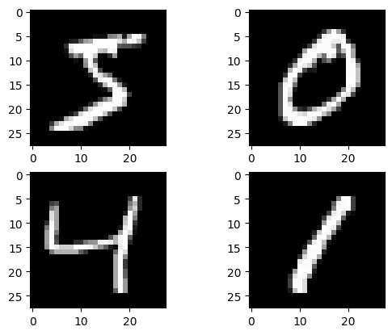

#  Image Denoising using Non-Local Means

Proyek ini menerapkan algoritma **Non-Local Means Denoising** untuk membersihkan noise dari gambar nyata (real noisy image) yang diunggah pengguna. Implementasi dijalankan dalam lingkungan Google Colab menggunakan pustaka `scikit-image`.

---

## Struktur Proyek

* `Image_Denoising.ipynb`: Notebook utama untuk melakukan denoising gambar.
* `denoised_output.png`: Hasil akhir gambar setelah noise dihilangkan.

---

##  Fitur Utama

* Upload gambar noisy langsung dari komputer pengguna.
* Konversi ke grayscale untuk pemrosesan satu channel.
* Estimasi noise (`sigma`) dari gambar secara otomatis.
* Penerapan algoritma **Non-Local Means** untuk menghilangkan noise.
* Visualisasi perbandingan gambar sebelum dan sesudah denoising.
* Menyimpan hasil denoising ke file output.

---

##  Perubahan & Modifikasi

Modifikasi yang telah dilakukan dalam notebook meliputi:

*  **Fitur upload interaktif** dari lokal ke Colab menggunakan `google.colab.files`.
*  **Konversi otomatis ke grayscale** sebelum denoising.
*  **Estimasi noise secara dinamis** menggunakan `estimate_sigma`.
*  **Penggunaan parameter denoising yang disesuaikan** agar hasil lebih halus.
*  **Penyimpanan hasil otomatis** ke file PNG yang bisa diunduh.

---

##  Cara Menjalankan

1. Buka `Image_Denoising.ipynb` di Google Colab.
2. Jalankan semua sel satu per satu dari atas ke bawah.
3. Upload gambar berformat JPG/PNG saat diminta.
4. Lihat hasil visualisasi perbandingan.
5. Unduh hasil dari file `denoised_output.png`.

---

##  Contoh Hasil

### Gambar Asli (Noisy)

### Gambar Setelah Denoising

---

##  Referensi

* Dokumentasi `scikit-image`: [https://scikit-image.org/docs/stable/](https://scikit-image.org/docs/stable/)
* Tutorial Non-Local Means Denoising: [https://scikit-image.org/docs/stable/auto\_examples/filters/plot\_denoise.html](https://scikit-image.org/docs/stable/auto_examples/filters/plot_denoise.html)
* GitHub repo asli: [Image-Denoising by WarriorRy](https://github.com/WarriorRy/Image-Denoising)

---

– Fikri Nofan Dwi Andika
